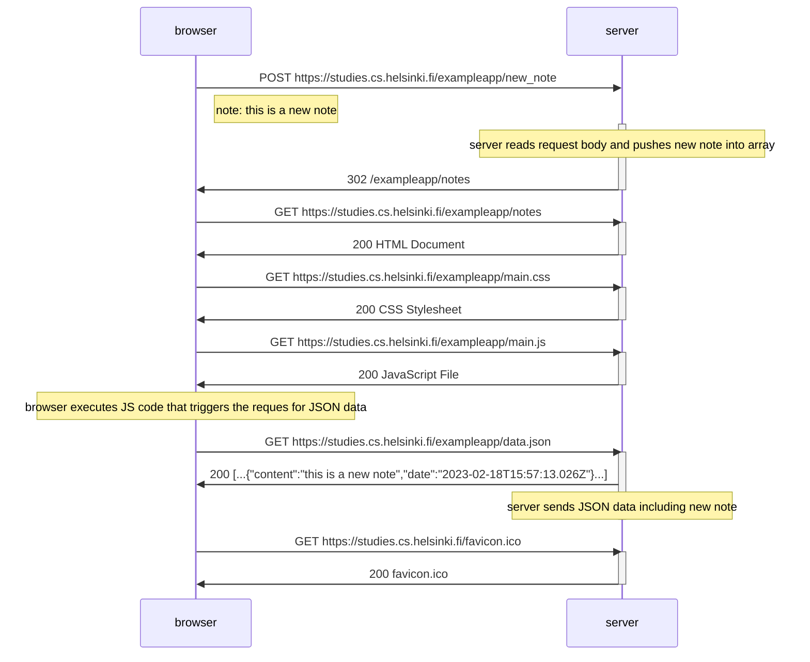

```mermaid
sequenceDiagram
    participant browser
    participant server
    
    browser->>server: POST https://studies.cs.helsinki.fi/exampleapp/new_note
    Note right of browser: note: this is a new note
    activate server
    Note over server: server reads request body and pushes new note into array
    server->>browser: 302 /exampleapp/notes
    deactivate server
    browser->>server: GET https://studies.cs.helsinki.fi/exampleapp/notes
    activate server
    server->>browser: 200 HTML Document
    deactivate server
    browser->> server: GET https://studies.cs.helsinki.fi/exampleapp/main.css
    activate server
    server->>browser: 200 CSS Stylesheet
    deactivate server
    browser->>server: GET https://studies.cs.helsinki.fi/exampleapp/main.js
    activate server
    server->>browser: 200 JavaScript File
    deactivate server
    Note over browser: browser executes JS code that triggers the reques for JSON data
    browser->>server: GET https://studies.cs.helsinki.fi/exampleapp/data.json
    activate server
    server->>browser: 200 [...{"content":"this is a new note","date":"2023-02-18T15:57:13.026Z"}...]
    Note over server: server sends JSON data including new note
    deactivate server
    browser->>server: GET https://studies.cs.helsinki.fi/favicon.ico
    activate server
    server->>browser: 200 favicon.ico 
    deactivate server
```
 
