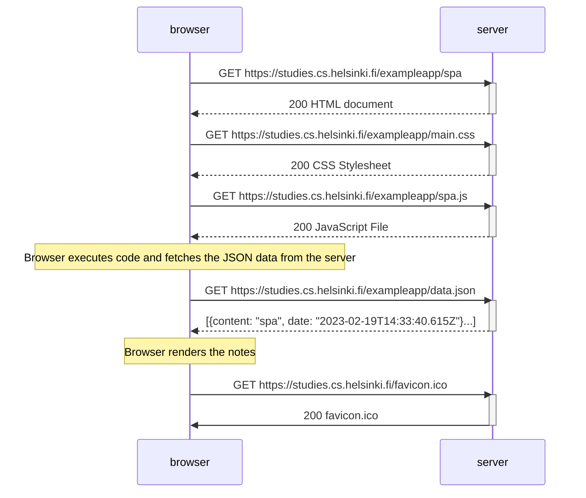

```mermaid
sequenceDiagram
    participant browser
    participant server
    
    browser->>server: GET https://studies.cs.helsinki.fi/exampleapp/spa
    activate server
    server-->>browser: 200 HTML document
    deactivate server
    browser->>server: GET https://studies.cs.helsinki.fi/exampleapp/main.css
    activate server
    server-->>browser: 200 CSS Stylesheet
    deactivate server
    browser->>server: GET https://studies.cs.helsinki.fi/exampleapp/spa.js
    activate server
    server-->>browser: 200 JavaScript File
    deactivate server
    Note over browser: Browser executes code and fetches the JSON data from the server
    browser->>server: GET https://studies.cs.helsinki.fi/exampleapp/data.json
    activate server
    server-->>browser: [{content: "spa", date: "2023-02-19T14:33:40.615Z"}...]
    deactivate server    
    Note over browser: Browser renders the notes
    browser->>server: GET https://studies.cs.helsinki.fi/favicon.ico
    activate server
    server->>browser: 200 favicon.ico 
    deactivate server 
```
