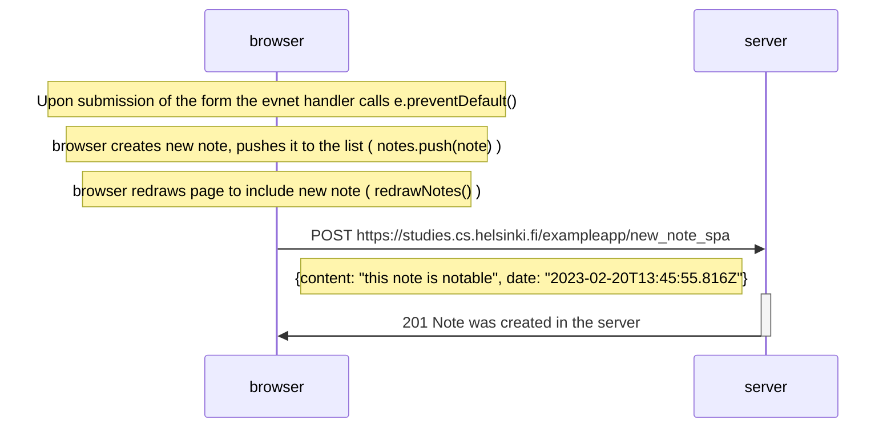

```mermaid
sequenceDiagram
    participant browser
    participant server
    
    Note over browser: Upon submission of the form the evnet handler calls e.preventDefault()
    Note over browser: browser creates new note, pushes it to the list ( notes.push(note) )
    Note over browser: browser redraws page to include new note ( redrawNotes() )
    browser->>server: POST https://studies.cs.helsinki.fi/exampleapp/new_note_spa
    Note right of browser: {content: "this note is notable", date: "2023-02-20T13:45:55.816Z"}
    activate server
    server->>browser: 201 Note was created in the server
    deactivate server
```
